# ECRP — Technical Documentation

> **Ethiopian Community Ride-sharing Platform**
>
> A full-stack Next.js monolith for voluntary, community-based ride-sharing in Ethiopia.
> Drivers with empty seats offer rides along their daily routes; passengers request pickups.
> No payments — drivers earn a **Service Score** for verified trip completions.

---

## Table of Contents

- [1. Architecture Overview](#1-architecture-overview)
- [2. Tech Stack](#2-tech-stack)
- [3. Project Structure](#3-project-structure)
- [4. Authentication System](#4-authentication-system)
  - [4.1 Three-Role Auth Separation](#41-three-role-auth-separation)
  - [4.2 Telegram OAuth Flow](#42-telegram-oauth-flow)
  - [4.3 Admin Email/Password Auth](#43-admin-emailpassword-auth)
  - [4.4 Session Management](#44-session-management)
  - [4.5 Client-Side Auth Helpers](#45-client-side-auth-helpers)
- [5. Middleware & Route Protection (RBAC)](#5-middleware--route-protection-rbac)
- [6. Rate Limiting](#6-rate-limiting)
- [7. Database Schema](#7-database-schema)
  - [7.1 Entity-Relationship Diagram](#71-entity-relationship-diagram)
  - [7.2 Table Reference](#72-table-reference)
  - [7.3 Migrations](#73-migrations)
- [8. Ride Matching Algorithm](#8-ride-matching-algorithm)
  - [8.1 Matching Flow](#81-matching-flow)
  - [8.2 Proximity Filtering & Scoring](#82-proximity-filtering--scoring)
  - [8.3 Gebeta Matrix API Integration](#83-gebeta-matrix-api-integration)
  - [8.4 Haversine Fallback](#84-haversine-fallback)
- [9. Trip State Machine](#9-trip-state-machine)
  - [9.1 State Diagram](#91-state-diagram)
  - [9.2 Transition Table](#92-transition-table)
  - [9.3 Audit Logging](#93-audit-logging)
- [10. Real-Time System (Pusher)](#10-real-time-system-pusher)
  - [10.1 Architecture](#101-architecture)
  - [10.2 Channel Authentication](#102-channel-authentication)
  - [10.3 GPS Telemetry Pipeline](#103-gps-telemetry-pipeline)
  - [10.4 Event Types](#104-event-types)
- [11. Geocoding & Maps](#11-geocoding--maps)
  - [11.1 Geocoding Pipeline](#111-geocoding-pipeline)
  - [11.2 API Proxy Routes](#112-api-proxy-routes)
- [12. Service Score System](#12-service-score-system)
- [13. Emergency Alert (Panic) System](#13-emergency-alert-panic-system)
- [14. Admin Dashboard](#14-admin-dashboard)
- [15. Driver Document Management](#15-driver-document-management)
- [16. API Reference](#16-api-reference)
- [17. Error Handling](#17-error-handling)
- [18. Environment Variables](#18-environment-variables)
- [19. Getting Started](#19-getting-started)

---

## 1. Architecture Overview

ECRP is built as a **Next.js 16 full-stack monolith** using the App Router pattern. Unlike a traditional microservices architecture, the entire application — frontend, API, authentication, and business logic — is deployed as a single unit. This dramatically simplifies deployment, debugging, and development at the cost of horizontal scaling (which is acceptable for a community platform).

The diagram below shows how data flows between the browser, the Next.js server, and external services. The browser communicates with the server over HTTP for API calls, while Pusher provides a separate WebSocket channel for real-time events (GPS updates, trip status changes). All external API keys (Gebeta Maps, LocationIQ) are kept server-side and proxied through API routes so they never reach the browser.

The single deployable unit handles:

- Server-rendered React UI (Server Components first)
- RESTful API routes for all business logic
- Authentication via three independent Better Auth instances
- Real-time event delivery via Pusher (managed WebSockets)
- Database access via Drizzle ORM to PostgreSQL (Neon Serverless)
- Geospatial computations via Gebeta Maps and LocationIQ proxied APIs

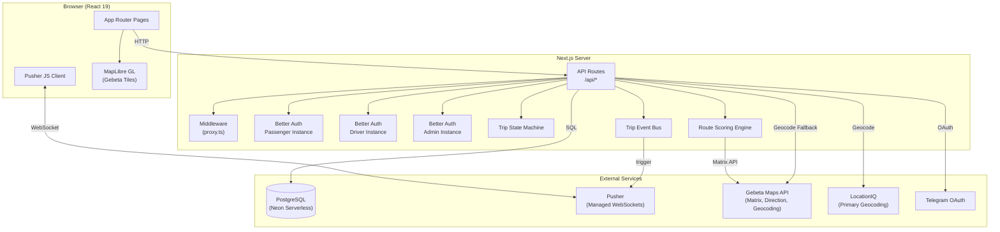
```mermaid
graph TB
    subgraph "Browser (React 19)"
        UI["App Router Pages"]
        PusherClient["Pusher JS Client"]
        MapComponent["MapLibre GL<br/>(Gebeta Tiles)"]
    end

    subgraph "Next.js Server"
        API["API Routes<br/>/api/*"]
        Middleware["Middleware<br/>(proxy.ts)"]
        AuthPassenger["Better Auth<br/>Passenger Instance"]
        AuthDriver["Better Auth<br/>Driver Instance"]
        AuthAdmin["Better Auth<br/>Admin Instance"]
        StateMachine["Trip State Machine"]
        ScoreRoute["Route Scoring Engine"]
        TripEvents["Trip Event Bus"]
    end

    subgraph "External Services"
        DB[("PostgreSQL<br/>(Neon Serverless)")]
        Pusher["Pusher<br/>(Managed WebSockets)"]
        Gebeta["Gebeta Maps API<br/>(Matrix, Direction, Geocoding)"]
        LocationIQ["LocationIQ<br/>(Primary Geocoding)"]
        Telegram["Telegram OAuth"]
    end

    UI -->|HTTP| API
    UI --> MapComponent
    PusherClient <-->|WebSocket| Pusher
    API --> Middleware
    API --> AuthPassenger & AuthDriver & AuthAdmin
    API --> StateMachine
    API --> ScoreRoute
    API --> TripEvents
    TripEvents -->|trigger| Pusher
    ScoreRoute -->|Matrix API| Gebeta
    API -->|SQL| DB
    API -->|Geocode| LocationIQ
    API -->|Geocode Fallback| Gebeta
    API -->|OAuth| Telegram
```

### Key Design Decisions

| Decision | Rationale |
|---|---|
| **Server Components first** | Minimize client bundle; data fetched server-side wherever possible |
| **Three separate Better Auth instances** | Hard role separation with independent session tables and cookie prefixes |
| **Pusher for real-time** | Offloads WebSocket management; fits free-tier constraints with throttling |
| **Gebeta Maps proxied through API routes** | API keys never exposed to the browser |
| **Typed state machine** | Enforces valid ride lifecycle transitions with audit logging |
| **Neon Serverless PostgreSQL** | Scales with serverless deployments; WebSocket-based connection pooling |

---

## 2. Tech Stack

| Layer | Technology | Version |
|---|---|---|
| Framework | Next.js (App Router) | 16.2.3 |
| Language | TypeScript | ^5 |
| UI Library | React | 19.2.4 |
| Styling | Tailwind CSS | ^4 |
| Component Library | shadcn/ui + Base UI | — |
| Authentication | Better Auth | ^1.6.2 |
| Database ORM | Drizzle ORM | ^0.45.2 |
| Database | PostgreSQL (Neon Serverless) | — |
| Real-Time | Pusher + pusher-js | 5.x / 8.x |
| Maps | Gebeta Maps (`@gebeta/tiles`) | ^2.1.5 |
| Geocoding (Primary) | LocationIQ | — |
| Icons | Lucide React | ^1.8.0 |
| Toasts | Sonner | ^2.0.7 |
| Testing | Vitest + @vitest/coverage-v8 | ^2.1.9 |
| DB Migrations | Drizzle Kit | ^0.31.10 |

---

## 3. Project Structure

```
src/
├── app/
│   ├── api/                      # All API routes
│   │   ├── auth/[...all]/        #   Passenger Better Auth handler
│   │   ├── driver-auth/[...all]/ #   Driver Better Auth handler
│   │   ├── admin-auth/[...all]/  #   Admin Better Auth handler
│   │   ├── telegram/callback/    #   Telegram OAuth callback
│   │   ├── realtime/auth/        #   Pusher private-channel auth
│   │   ├── rides/                #   Ride request, match, accept, reject
│   │   ├── trips/                #   Trip lifecycle (start, complete, cancel, location, panic)
│   │   ├── driver/               #   Driver availability, route, profile, documents
│   │   ├── passenger/            #   Passenger profile
│   │   ├── maps/                 #   Gebeta Maps proxy (geocode, matrix)
│   │   ├── gebeta/               #   Gebeta search, direction, reverse geocode
│   │   └── admin/                #   Admin dashboard endpoints
│   ├── admin/                    # Admin dashboard pages
│   ├── driver/                   # Driver dashboard
│   ├── passenger/                # Passenger ride-request page
│   ├── trip/[id]/                # Active trip tracking page
│   ├── trips/                    # Trip history (driver & passenger)
│   ├── login/                    # Telegram login page
│   └── onboarding/               # Role selection & driver onboarding
├── components/
│   ├── app-map.tsx               # Gebeta map wrapper (lazy-loaded via next/dynamic)
│   ├── map-inner.tsx             # Inner map with markers & polylines
│   ├── bottom-nav.tsx            # Mobile navigation bar
│   ├── profile-sheet.tsx         # Slide-up profile panel
│   └── ui/                       # shadcn/ui primitives
├── db/
│   ├── index.ts                  # Drizzle client (Neon Serverless + WebSocket)
│   ├── schema.ts                 # All table definitions
│   ├── schema-admin.ts           # Re-exports for admin auth tables
│   ├── schema-driver.ts          # Re-exports for driver auth tables
│   ├── schema-passenger.ts       # Re-exports for passenger auth tables
│   ├── migrations/               # SQL migration files
│   └── seed.ts                   # Super admin seed script
└── lib/
    ├── auth.ts                   # Re-exports all three auth instances
    ├── auth-admin.ts             # Admin Better Auth instance
    ├── auth-driver.ts            # Driver Better Auth instance
    ├── auth-passenger.ts         # Passenger Better Auth instance
    ├── auth-client.ts            # Client-side auth helpers & hooks
    ├── auth-role.ts              # Role resolution utilities
    ├── admin-role.ts             # Admin role type guards
    ├── gebeta.ts                 # Gebeta Maps API client (geocode, direction, search)
    ├── locationiq.ts             # LocationIQ geocoding client
    ├── pusher-server.ts          # Pusher server-side singleton
    ├── pusher-client.ts          # Pusher browser-side singleton
    ├── score-route.ts            # Driver–passenger route matching & ranking
    ├── state-machine.ts          # Trip lifecycle state machine
    ├── trip-events.ts            # Pusher event emitter + audit log writer
    ├── generate-id.ts            # Timestamp + random ID generator
    └── api-error.ts              # Typed API error response helpers
```

---

## 4. Authentication System

### 4.1 Three-Role Auth Separation

ECRP uses **three independent Better Auth instances** that share a single PostgreSQL database but maintain completely separate user tables, session tables, and cookie namespaces. This provides hard role separation — a user cannot accidentally escalate from passenger to admin.

The diagram below shows this architecture: each Better Auth instance has its own base path, cookie prefix, and dedicated set of four database tables. Even though all tables live in the same PostgreSQL database, they are completely independent — a passenger session cookie cannot be used to access driver endpoints, and vice versa.

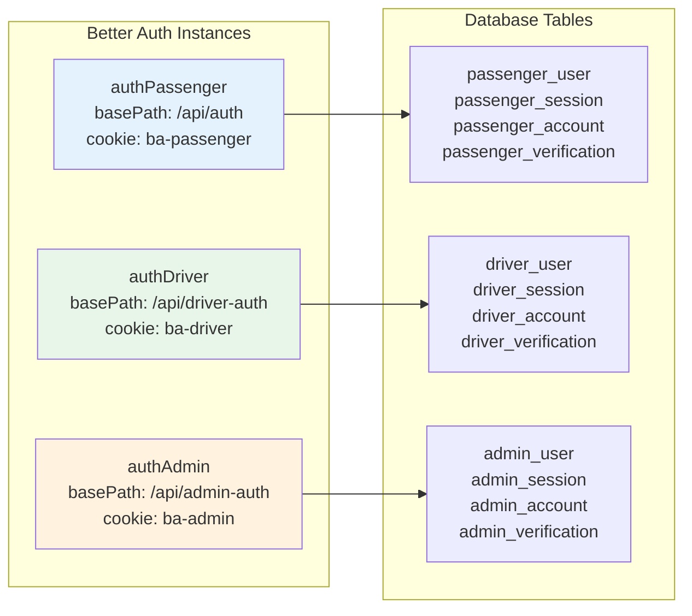
```mermaid
graph LR
    subgraph "Better Auth Instances"
        PA["authPassenger<br/>basePath: /api/auth<br/>cookie: ba-passenger"]
        DA["authDriver<br/>basePath: /api/driver-auth<br/>cookie: ba-driver"]
        AA["authAdmin<br/>basePath: /api/admin-auth<br/>cookie: ba-admin"]
    end

    subgraph "Database Tables"
        PT["passenger_user<br/>passenger_session<br/>passenger_account<br/>passenger_verification"]
        DT["driver_user<br/>driver_session<br/>driver_account<br/>driver_verification"]
        AT["admin_user<br/>admin_session<br/>admin_account<br/>admin_verification"]
    end

    PA --> PT
    DA --> DT
    AA --> AT

    style PA fill:#e3f2fd
    style DA fill:#e8f5e9
    style AA fill:#fff3e0
```

| Role | Cookie Prefix | Auth Route | Login Method | Session TTL |
|---|---|---|---|---|
| Passenger | `ba-passenger` | `/api/auth` | Telegram OAuth | 7 days |
| Driver | `ba-driver` | `/api/driver-auth` | Telegram OAuth | 7 days |
| Admin | `ba-admin` | `/api/admin-auth` | Email + Password | 7 days |

Each auth instance uses:
- **Drizzle adapter** for database access with role-specific schema re-exports
- **`nextCookies()` plugin** for seamless Next.js cookie handling
- **`emailAndPassword` enabled** with minimum 8-character passwords
- **Session refresh** every 24 hours (`updateAge: 60 * 60 * 24`)

### 4.2 Telegram OAuth Flow

Passengers and drivers authenticate exclusively via the **Telegram Login Widget**. Since Telegram doesn't expose user email addresses, the system generates **synthetic emails** in the format `tg_{telegramId}@telegram.local` to satisfy Better Auth's email-based user model. This means no real email verification is performed — identity is established entirely through Telegram's cryptographic hash.

The diagram below traces a complete login from widget click to authenticated redirect. The callback endpoint (`/api/telegram/callback`) acts as a bridge: it verifies Telegram's HMAC signature, upserts the user record, creates a session, and sets the appropriate role-specific cookie before redirecting to the dashboard.

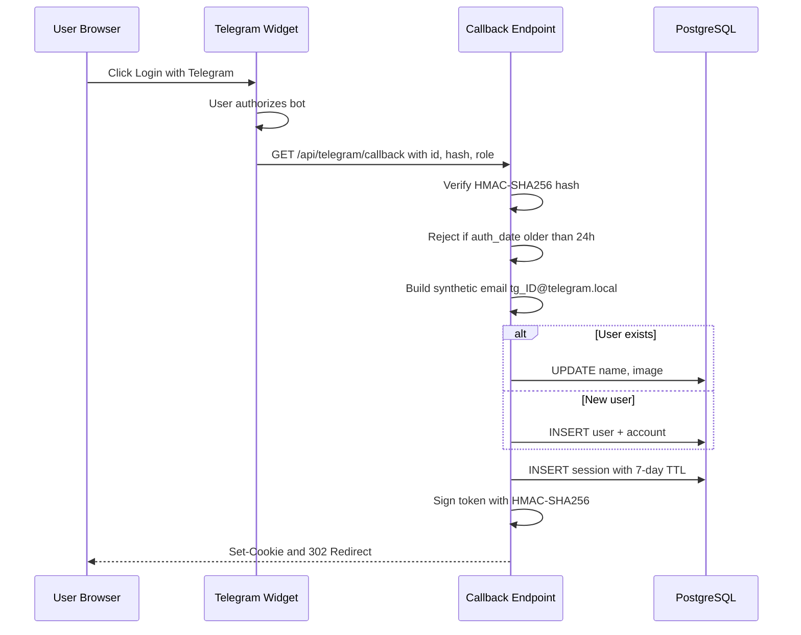
```mermaid
sequenceDiagram
    participant U as User Browser
    participant TG as Telegram Widget
    participant CB as Callback Endpoint
    participant DB as PostgreSQL

    U->>TG: Click Login with Telegram
    TG->>TG: User authorizes bot
    TG->>CB: GET /api/telegram/callback with id, hash, role

    CB->>CB: Verify HMAC-SHA256 hash
    CB->>CB: Reject if auth_date older than 24h
    CB->>CB: Build synthetic email tg_ID@telegram.local

    alt User exists
        CB->>DB: UPDATE name, image
    else New user
        CB->>DB: INSERT user + account
    end

    CB->>DB: INSERT session with 7-day TTL
    CB->>CB: Sign token with HMAC-SHA256
    CB-->>U: Set-Cookie and 302 Redirect
```

**How Telegram Hash Verification works in detail:**

The callback must confirm that the query parameters genuinely came from Telegram and haven't been tampered with. The verification algorithm works as follows:

1. **Extract** all query parameters except `hash` from the callback URL
2. **Sort** the remaining keys alphabetically and join them as `key=value\n` (newline-separated)
3. **Compute** `HMAC-SHA256(SHA256(botToken), dataCheckString)` — the bot token is first hashed with SHA-256 to derive the signing key, then HMAC-SHA256 produces the verification hash
4. **Compare** the computed hash with the provided `hash` parameter — if they match, the data is authentic

This two-layer hashing (SHA-256 of the bot token as the HMAC key) is Telegram's standard verification protocol. The `auth_date` field is also checked to reject stale callbacks older than 24 hours.

**Cookie Security (applied to all roles):**

After successful authentication, the session cookie is configured with defense-in-depth settings:

- `HttpOnly: true` — prevents JavaScript access, mitigating XSS token theft
- `Secure: true` — only sent over HTTPS (when `BETTER_AUTH_URL` starts with `https://`)
- `SameSite: lax` — provides CSRF protection while allowing top-level navigation
- `__Secure-` prefix — automatically added for HTTPS deployments, providing an additional browser-enforced security layer
- **Signed tokens** — the session token format is `{token}.{base64(HMAC-SHA256(token, secret))}`, where the signature prevents forgery even if the token value is leaked

### 4.3 Admin Email/Password Auth

Admins authenticate with email and password through Better Auth's built-in `emailAndPassword` provider. The initial super admin is created via the seed script:

```bash
# Required env vars (no defaults)
ADMIN_EMAIL=admin@example.com
ADMIN_PASSWORD=strong-password-here

npm run db:seed
```

The seed script:
1. Creates an admin user via `authAdmin.api.signUpEmail`
2. Promotes the user to `super_admin` role via direct DB update
3. Only super admins can create additional admin accounts

**Admin Roles:**

| Role | Permissions |
|---|---|
| `admin` | View dashboard, manage trips, resolve alerts |
| `super_admin` | All admin permissions + create/manage other admins |

### 4.4 Session Management

Every authenticated request goes through the session validation pipeline shown below. The system performs a two-phase check: first it verifies the cookie's cryptographic signature (fast, no DB hit), then it queries the session table to check expiration and potentially refresh the session. This means forged cookies are rejected immediately without touching the database.

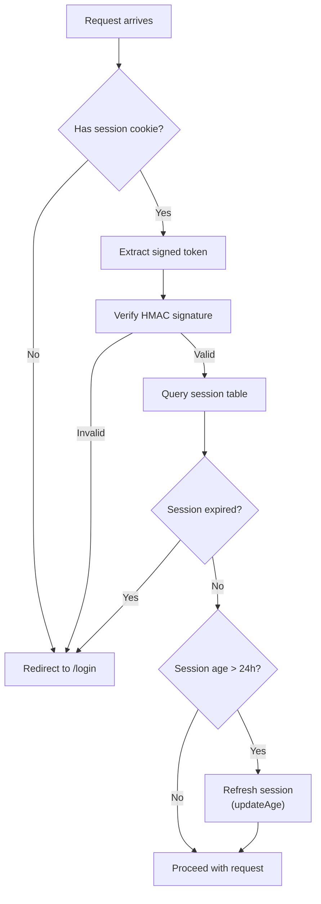
```mermaid
graph TD
    A["Request arrives"] --> B{Has session cookie?}
    B -->|No| C["Redirect to /login"]
    B -->|Yes| D["Extract signed token"]
    D --> E["Verify HMAC signature"]
    E -->|Invalid| C
    E -->|Valid| F["Query session table"]
    F --> G{Session expired?}
    G -->|Yes| C
    G -->|No| H{Session age > 24h?}
    H -->|Yes| I["Refresh session<br/>(updateAge)"]
    H -->|No| J["Proceed with request"]
    I --> J
```

- Sessions expire after **7 days** (`expiresIn: 60 * 60 * 24 * 7`)
- Sessions auto-refresh after **24 hours** of inactivity (`updateAge: 60 * 60 * 24`)
- Each session records `ipAddress` and `userAgent` for audit purposes
- Sessions cascade-delete when the user is deleted

### 4.5 Client-Side Auth Helpers

Three client-side auth instances are created in `src/lib/auth-client.ts`:

```typescript
passengerAuthClient  // basePath: /api/auth
driverAuthClient     // basePath: /api/driver-auth
adminAuthClient      // basePath: /api/admin-auth
```

Pre-bound hooks for React components:
- `usePassengerSession` — returns current passenger session
- `useDriverSession` — returns current driver session
- `useAdminSession` — returns current admin session

---

## 5. Middleware & Route Protection (RBAC)

The middleware layer (`src/proxy.ts`) provides **Role-Based Access Control (RBAC)** and is the central gatekeeper for all requests. Every request — whether it's an API call or a page navigation — passes through this middleware before reaching the handler.

The flowchart below shows the complete decision tree. API requests (`/api/*`) are rate-limited first and then passed through. Page requests are checked against a role mapping: each URL pattern requires a specific role (passenger, driver, either, or admin), and the middleware validates the appropriate session cookie before allowing access. If no valid session is found, the user is redirected to the login page.

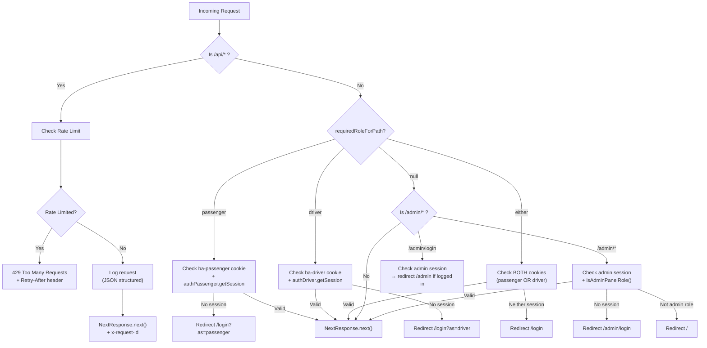
```mermaid
flowchart TD
    REQ["Incoming Request"] --> IS_API{Is /api/* ?}

    IS_API -->|Yes| RL["Check Rate Limit"]
    RL --> RL_RESULT{Rate Limited?}
    RL_RESULT -->|Yes| R429["429 Too Many Requests<br/>+ Retry-After header"]
    RL_RESULT -->|No| LOG["Log request<br/>(JSON structured)"]
    LOG --> API_PASS["NextResponse.next()<br/>+ x-request-id"]

    IS_API -->|No| ROLE{requiredRoleForPath?}

    ROLE -->|passenger| CHECK_P["Check ba-passenger cookie<br/>+ authPassenger.getSession"]
    ROLE -->|driver| CHECK_D["Check ba-driver cookie<br/>+ authDriver.getSession"]
    ROLE -->|either| CHECK_BOTH["Check BOTH cookies<br/>(passenger OR driver)"]
    ROLE -->|null| IS_ADMIN{Is /admin/* ?}

    CHECK_P -->|No session| LOGIN_P["Redirect /login?as=passenger"]
    CHECK_D -->|No session| LOGIN_D["Redirect /login?as=driver"]
    CHECK_BOTH -->|Neither session| LOGIN["Redirect /login"]

    CHECK_P -->|Valid| PASS["NextResponse.next()"]
    CHECK_D -->|Valid| PASS
    CHECK_BOTH -->|Valid| PASS

    IS_ADMIN -->|/admin/login| ADMIN_LOGIN["Check admin session<br/>→ redirect /admin if logged in"]
    IS_ADMIN -->|/admin/*| ADMIN_CHECK["Check admin session<br/>+ isAdminPanelRole()"]
    IS_ADMIN -->|No| PASS

    ADMIN_CHECK -->|No session| ADMIN_REDIRECT["Redirect /admin/login"]
    ADMIN_CHECK -->|Not admin role| HOME["Redirect /"]
    ADMIN_CHECK -->|Valid| PASS
```

**Route → Role Mapping:**

| Path Pattern | Required Role |
|---|---|
| `/passenger`, `/passenger/*` | `passenger` |
| `/driver`, `/driver/*` | `driver` |
| `/trips/passenger`, `/trips/passenger/*` | `passenger` |
| `/trips/driver`, `/trips/driver/*` | `driver` |
| `/trip/*`, `/trips` | `either` (passenger OR driver) |
| `/admin/*` (except `/admin/login`) | `admin` or `super_admin` |
| `/admin/login` | Public (redirects if already authenticated) |

**Request ID Tracking:**
Every response includes an `x-request-id` header (from the request's `x-request-id` or a newly generated UUID), enabling end-to-end request tracing.

---

## 6. Rate Limiting

ECRP implements **in-memory, per-IP rate limiting** in the middleware layer. Limits are enforced per API route pattern using a sliding-window token bucket.

The flowchart below shows how each API request is evaluated: the client IP is extracted from proxy headers, the request path is normalized (dynamic segments like UUIDs replaced with `[id]`), and the resulting key is checked against the in-memory bucket store. If the bucket is full, a 429 response is returned with a `Retry-After` header telling the client when to retry.

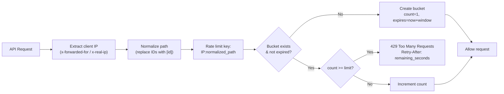
```mermaid
flowchart LR
    REQ["API Request"] --> EXTRACT["Extract client IP<br/>(x-forwarded-for / x-real-ip)"]
    EXTRACT --> NORMALIZE["Normalize path<br/>(replace IDs with [id])"]
    NORMALIZE --> KEY["Rate limit key:<br/>IP:normalized_path"]
    KEY --> LOOKUP{Bucket exists<br/>& not expired?}
    LOOKUP -->|No| CREATE["Create bucket<br/>count=1, expires=now+window"]
    LOOKUP -->|Yes| CHECK{count >= limit?}
    CHECK -->|Yes| BLOCK["429 Too Many Requests<br/>Retry-After: remaining_seconds"]
    CHECK -->|No| INCREMENT["Increment count"]
    CREATE --> ALLOW["Allow request"]
    INCREMENT --> ALLOW
```

### Rate Limit Rules

| Route Pattern | Limit | Window | Purpose |
|---|---|---|---|
| `/api/auth/*` | 10 req | 60 sec | Prevent brute-force on passenger auth |
| `/api/driver-auth/*` | 10 req | 60 sec | Prevent brute-force on driver auth |
| `/api/admin-auth/*` | 5 req | 60 sec | Stricter limit for admin auth |
| `/api/rides/request` | 5 req | 60 sec | Prevent ride request spam |
| `/api/trips/[id]/location` | 30 req | 10 sec | Allow GPS updates but cap throughput |
| `/api/trips/[id]/panic` | 3 req | 60 sec | Prevent panic button spam |

**Implementation Details:**
- **Storage:** In-memory `Map<string, RateLimitBucket>` (resets on server restart)
- **Key normalization:** Dynamic path segments (UUIDs/IDs) are replaced with `[id]` so all trips share a rate limit key pattern
- **IP extraction:** `x-forwarded-for` (first IP) → `x-real-ip` → `"unknown"`
- **Response format:**
  ```json
  {
    "error": "Too many requests.",
    "code": "RATE_LIMITED",
    "status": 429
  }
  ```
  With `Retry-After` header indicating seconds until the window resets.

---

## 7. Database Schema

### 7.1 Entity-Relationship Diagrams

The database schema is split into three diagrams for clarity. All tables live in the same PostgreSQL database — the split is purely for readability since GitHub's Mermaid renderer has a complexity limit on single diagrams.

#### Passenger Domain

The passenger domain consists of four Better Auth tables (user, session, account, verification) plus the ride_request table that passengers create. Each passenger can have multiple active sessions (e.g., different devices) and multiple ride requests over time. The `passenger_account` table stores the Telegram provider linkage with the synthetic email.

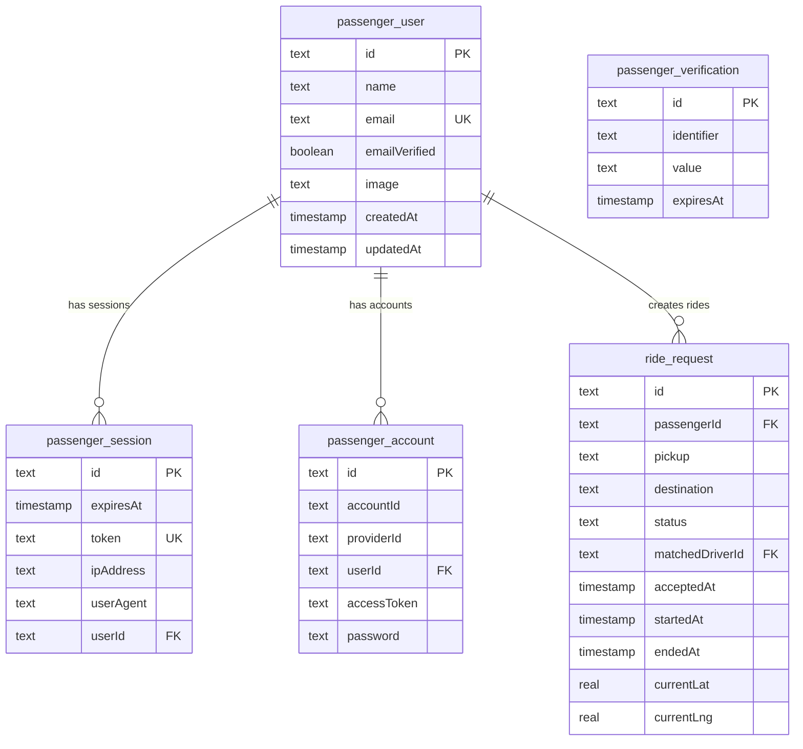
```mermaid
erDiagram
    passenger_user {
        text id PK
        text name
        text email UK
        boolean emailVerified
        text image
        timestamp createdAt
        timestamp updatedAt
    }

    passenger_session {
        text id PK
        timestamp expiresAt
        text token UK
        text ipAddress
        text userAgent
        text userId FK
    }

    passenger_account {
        text id PK
        text accountId
        text providerId
        text userId FK
        text accessToken
        text password
    }

    passenger_verification {
        text id PK
        text identifier
        text value
        timestamp expiresAt
    }

    ride_request {
        text id PK
        text passengerId FK
        text pickup
        text destination
        text status
        text matchedDriverId FK
        timestamp acceptedAt
        timestamp startedAt
        timestamp endedAt
        real currentLat
        real currentLng
    }

    passenger_user ||--o{ passenger_session : "has sessions"
    passenger_user ||--o{ passenger_account : "has accounts"
    passenger_user ||--o{ ride_request : "creates rides"
```

#### Driver Domain

The driver domain is the most extensive. Beyond the standard auth tables, drivers have a `driver_profile` (vehicle info and reputation scores), a `driver_availability` record (online status and declared route coordinates), and a `driver_document` collection (uploaded verification documents). The `ride_rejection` table tracks which rides a driver has declined, preventing the system from re-matching the same driver.

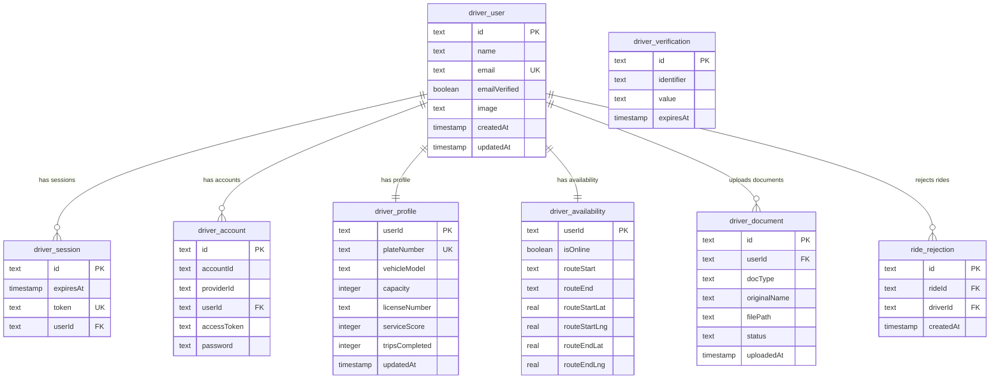
```mermaid
erDiagram
    driver_user {
        text id PK
        text name
        text email UK
        boolean emailVerified
        text image
        timestamp createdAt
        timestamp updatedAt
    }

    driver_session {
        text id PK
        timestamp expiresAt
        text token UK
        text userId FK
    }

    driver_account {
        text id PK
        text accountId
        text providerId
        text userId FK
        text accessToken
        text password
    }

    driver_verification {
        text id PK
        text identifier
        text value
        timestamp expiresAt
    }

    driver_profile {
        text userId PK
        text plateNumber UK
        text vehicleModel
        integer capacity
        text licenseNumber
        integer serviceScore
        integer tripsCompleted
        timestamp updatedAt
    }

    driver_availability {
        text userId PK
        boolean isOnline
        text routeStart
        text routeEnd
        real routeStartLat
        real routeStartLng
        real routeEndLat
        real routeEndLng
    }

    driver_document {
        text id PK
        text userId FK
        text docType
        text originalName
        text filePath
        text status
        timestamp uploadedAt
    }

    ride_rejection {
        text id PK
        text rideId FK
        text driverId FK
        timestamp createdAt
    }

    driver_user ||--o{ driver_session : "has sessions"
    driver_user ||--o{ driver_account : "has accounts"
    driver_user ||--|| driver_profile : "has profile"
    driver_user ||--|| driver_availability : "has availability"
    driver_user ||--o{ driver_document : "uploads documents"
    driver_user ||--o{ ride_rejection : "rejects rides"
```

#### Admin Domain and Shared Tables

The admin domain includes auth tables with an extra `role` column on `admin_user` (either `admin` or `super_admin`). The `admin_alert` table stores panic button alerts triggered by passengers or drivers — admins resolve these from the dashboard. The `trip_event` table is an append-only audit log recording every state transition in a ride's lifecycle, including who performed the action and any metadata (JSON).

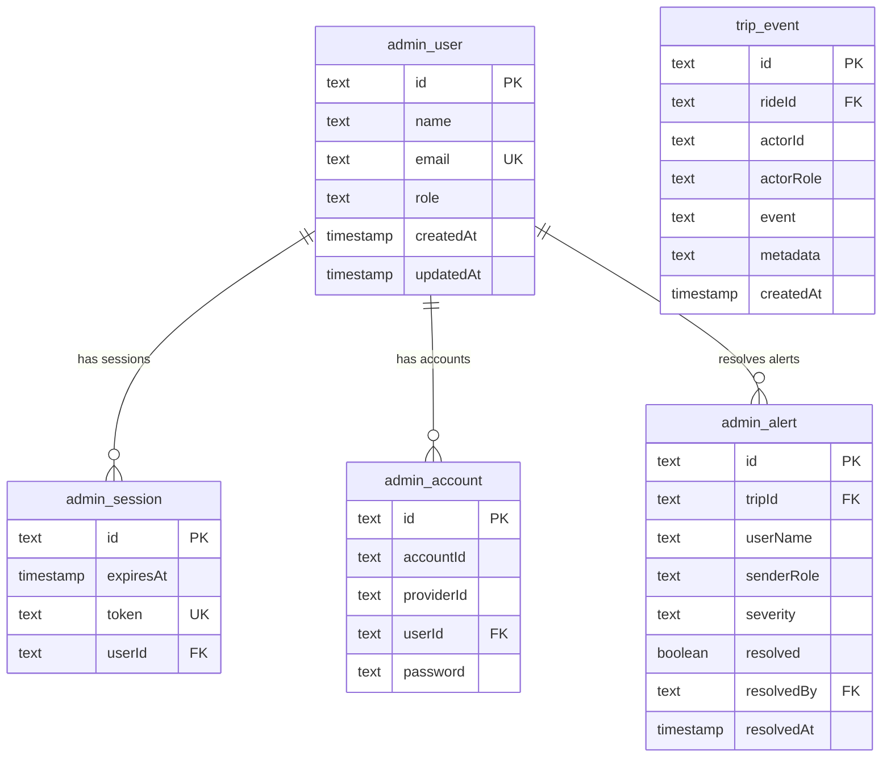
```mermaid
erDiagram
    admin_user {
        text id PK
        text name
        text email UK
        text role
        timestamp createdAt
        timestamp updatedAt
    }

    admin_session {
        text id PK
        timestamp expiresAt
        text token UK
        text userId FK
    }

    admin_account {
        text id PK
        text accountId
        text providerId
        text userId FK
        text password
    }

    admin_alert {
        text id PK
        text tripId FK
        text userName
        text senderRole
        text severity
        boolean resolved
        text resolvedBy FK
        timestamp resolvedAt
    }

    trip_event {
        text id PK
        text rideId FK
        text actorId
        text actorRole
        text event
        text metadata
        timestamp createdAt
    }

    admin_user ||--o{ admin_session : "has sessions"
    admin_user ||--o{ admin_account : "has accounts"
    admin_user ||--o{ admin_alert : "resolves alerts"
```

#### Cross-Domain Relationships

The following table summarizes the foreign key relationships that span across the domain boundaries shown above:

| From Table | Column | References | Relationship |
|---|---|---|---|
| `ride_request` | `passengerId` | `passenger_user.id` | Each ride belongs to one passenger |
| `ride_request` | `matchedDriverId` | `driver_user.id` | Assigned driver (nullable until matched) |
| `ride_rejection` | `rideId` | `ride_request.id` | Tracks which ride was rejected |
| `ride_rejection` | `driverId` | `driver_user.id` | Which driver rejected it |
| `admin_alert` | `tripId` | `ride_request.id` | Panic alert linked to a trip |
| `admin_alert` | `resolvedBy` | `admin_user.id` | Which admin resolved it |
| `trip_event` | `rideId` | `ride_request.id` | Audit log entries for a ride |
| `driver_document` | `reviewedByAdminId` | `admin_user.id` | Admin who reviewed the document |

### 7.2 Table Reference

#### Auth Tables (per role × 4 tables = 12 total)

Each role (passenger, driver, admin) has four Better Auth tables:

| Table | Purpose | Key Columns |
|---|---|---|
| `{role}_user` | User identity | `id`, `name`, `email` (unique), `emailVerified`, `image` |
| `{role}_session` | Active sessions | `id`, `token` (unique), `userId` → user, `expiresAt`, `ipAddress`, `userAgent` |
| `{role}_account` | Auth providers | `id`, `providerId` (telegram/credential), `accountId`, `userId` → user, `password` |
| `{role}_verification` | Email verification tokens | `id`, `identifier`, `value`, `expiresAt` |

**Admin-specific:** `admin_user` has an additional `role` column (`admin` | `super_admin`).

#### Business Tables

| Table | Purpose | Key Columns |
|---|---|---|
| `driver_profile` | Vehicle & reputation data | `userId` (PK, FK → driver_user), `plateNumber` (unique), `vehicleModel`, `capacity`, `licenseNumber`, `serviceScore`, `tripsCompleted` |
| `driver_availability` | Online status & route | `userId` (PK, FK → driver_user), `isOnline`, `routeStart/End` (text), `routeStartLat/Lng`, `routeEndLat/Lng` |
| `ride_request` | Core ride lifecycle | `id`, `passengerId` → passenger_user, `pickup`, `destination`, `status`, `matchedDriverId` → driver_user, timestamps (`acceptedAt`, `startedAt`, `endedAt`), `currentLat/Lng` |
| `ride_rejection` | Prevents re-matching | `id`, `rideId` → ride_request, `driverId` → driver_user |
| `admin_alert` | Panic button alerts | `id`, `tripId` → ride_request, `userName`, `senderRole`, `location`, `coordinates`, `severity`, `resolved`, `resolvedBy` → admin_user |
| `driver_document` | Uploaded documents | `id`, `userId` → driver_user, `docType` (license\|registration\|insurance), `filePath`, `status` (pending\|verified\|rejected), `reviewedByAdminId` |
| `trip_event` | Full audit log | `id`, `rideId` → ride_request, `actorId`, `actorRole` (passenger\|driver\|system), `event`, `metadata` (JSON text) |

### 7.3 Migrations

Migrations are managed by **Drizzle Kit** and stored in `src/db/migrations/`:

| Migration | Description |
|---|---|
| `0000_fair_moonstone.sql` | Initial schema: auth tables, ride_request, driver_profile, admin_alert |
| `0001_exotic_ender_wiggin.sql` | Driver documents, ride_rejection |
| `0002_trip_location.sql` | Add `currentLat`/`currentLng` to ride_request |
| `0003_trip_event_audit.sql` | Trip event audit log table |
| `0004_driver_route_coords.sql` | Add lat/lng columns to driver_availability |

```bash
npm run db:generate   # Generate migration from schema changes
npm run db:push       # Push schema directly (dev)
npm run db:migrate    # Run pending migrations (production)
npm run db:studio     # Open Drizzle Studio GUI
```

---

## 8. Ride Matching Algorithm

### 8.1 Matching Flow

When a passenger submits a ride request, the server orchestrates a multi-step pipeline: it identifies available drivers, computes road distances via the Gebeta Matrix API, filters by proximity, ranks candidates, and persists the result. The diagram below shows this end-to-end flow. If coordinates are not provided in the request body, the server geocodes the place names first using LocationIQ (with Gebeta as fallback).

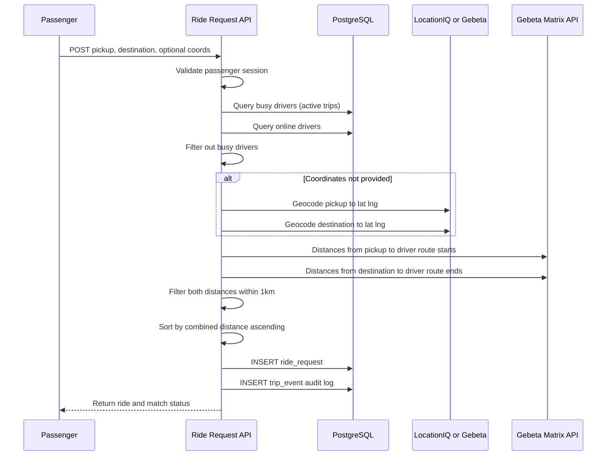
```mermaid
sequenceDiagram
    participant P as Passenger
    participant API as Ride Request API
    participant DB as PostgreSQL
    participant GEO as LocationIQ or Gebeta
    participant MATRIX as Gebeta Matrix API

    P->>API: POST pickup, destination, optional coords
    API->>API: Validate passenger session

    API->>DB: Query busy drivers (active trips)
    API->>DB: Query online drivers
    API->>API: Filter out busy drivers

    alt Coordinates not provided
        API->>GEO: Geocode pickup to lat lng
        API->>GEO: Geocode destination to lat lng
    end

    API->>MATRIX: Distances from pickup to driver route starts
    API->>MATRIX: Distances from destination to driver route ends

    API->>API: Filter both distances within 1km
    API->>API: Sort by combined distance ascending

    API->>DB: INSERT ride_request
    API->>DB: INSERT trip_event audit log
    API-->>P: Return ride and match status
```

### 8.2 Proximity Filtering & Scoring

The matching algorithm in `src/lib/score-route.ts` evaluates each online driver's declared route against the passenger's request. The key insight is that ECRP matches based on **route alignment**, not just raw proximity — a driver 500m away but heading in the opposite direction is not a good match, while a driver 800m away heading the same direction is ideal.

The flowchart below shows the complete pipeline. First, busy and coordinate-less drivers are filtered out. Then, the Gebeta Matrix API computes road distances (not straight-line) from the passenger's pickup to each driver's route start, and from the passenger's destination to each driver's route end. If the Matrix API fails for any pair, the system falls back to Haversine (great-circle) distance. Finally, only drivers within 1km on **both** ends are kept, and they're ranked by combined distance (pickup gap + destination gap).

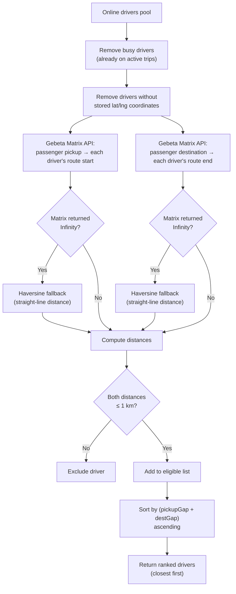
```mermaid
flowchart TD
    START["Online drivers pool"] --> FILTER_BUSY["Remove busy drivers<br/>(already on active trips)"]
    FILTER_BUSY --> FILTER_COORDS["Remove drivers without<br/>stored lat/lng coordinates"]
    FILTER_COORDS --> MATRIX_PICKUP["Gebeta Matrix API:<br/>passenger pickup → each driver's route start"]
    FILTER_COORDS --> MATRIX_DEST["Gebeta Matrix API:<br/>passenger destination → each driver's route end"]

    MATRIX_PICKUP --> FALLBACK_P{Matrix returned<br/>Infinity?}
    MATRIX_DEST --> FALLBACK_D{Matrix returned<br/>Infinity?}

    FALLBACK_P -->|Yes| HAVERSINE_P["Haversine fallback<br/>(straight-line distance)"]
    FALLBACK_P -->|No| COMBINE
    FALLBACK_D -->|Yes| HAVERSINE_D["Haversine fallback<br/>(straight-line distance)"]
    FALLBACK_D -->|No| COMBINE

    HAVERSINE_P --> COMBINE
    HAVERSINE_D --> COMBINE

    COMBINE["Compute distances"] --> PROX{Both distances<br/>≤ 1 km?}
    PROX -->|No| EXCLUDE["Exclude driver"]
    PROX -->|Yes| RANK["Add to eligible list"]

    RANK --> SORT["Sort by (pickupGap + destGap)<br/>ascending"]
    SORT --> BEST["Return ranked drivers<br/>(closest first)"]
```

**Eligibility Criteria:**
1. Driver must be **online** (`isOnline = true`)
2. Driver must **not** be on an active trip (status ∈ {matched, accepted, in_progress})
3. Driver must have **stored route coordinates** (lat/lng for both start and end)
4. Road distance from **passenger pickup** to **driver route start** ≤ **1 km**
5. Road distance from **passenger destination** to **driver route end** ≤ **1 km**

### 8.3 Gebeta Matrix API Integration

The Gebeta Matrix API computes road distances from one origin to multiple destinations in batches:

- **Batch size:** 24 destinations per request (API limit: 25 points = 1 origin + 24)
- **Timeout:** 8 seconds per batch
- **URL format:** `https://mapapi.gebeta.app/api/v1/route/matrix?apiKey=...&la1=...&lo1=...&la2=...&lo2=...`
- **Response parsing:** Each destination entry includes a `distance` field (meters), converted to km
- **Error handling:** Failed batches silently return `Infinity`; outer code falls back to Haversine

### 8.4 Haversine Fallback

When the Gebeta Matrix API is unavailable or returns no data, the system falls back to the **Haversine formula** for great-circle distance:

```
R = 6371 km (Earth's radius)
a = sin²(Δlat/2) + cos(lat1) · cos(lat2) · sin²(Δlng/2)
distance = R × 2 × arcsin(√a)
```

- Accuracy: ~0.5% for city-scale distances
- Used when: Matrix API key missing, timeout, or individual pair has no route data

---

## 9. Trip State Machine

### 9.1 State Diagram

Every ride in ECRP follows a strict lifecycle enforced by a typed state machine in `src/lib/state-machine.ts`. The state machine prevents illegal transitions — for example, a ride cannot jump from `requested` directly to `completed` without going through `accepted` first. Any API endpoint that changes ride status calls `assertTransition()`, which throws a `400 INVALID_TRANSITION` error if the transition is not allowed.

The diagram below shows all six states and the events that trigger transitions between them. Notice that `completed` and `cancelled` are **terminal states** — once a ride reaches either, no further transitions are possible. Also note that `reject` returns a ride from `matched` back to `requested`, effectively putting it back into the matching pool for other drivers.

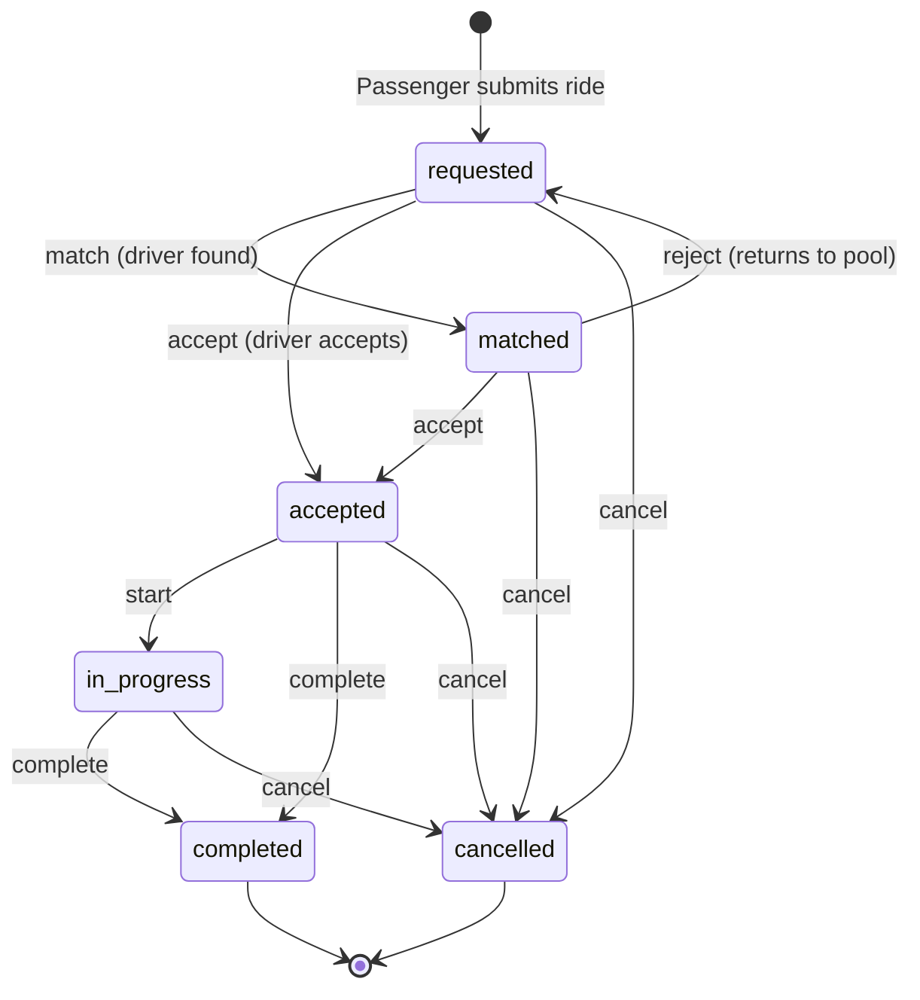
```mermaid
stateDiagram-v2
    [*] --> requested : Passenger submits ride

    requested --> matched : match (driver found)
    requested --> accepted : accept (driver accepts)
    requested --> cancelled : cancel

    matched --> accepted : accept
    matched --> requested : reject (returns to pool)
    matched --> cancelled : cancel

    accepted --> in_progress : start
    accepted --> completed : complete
    accepted --> cancelled : cancel

    in_progress --> completed : complete
    in_progress --> cancelled : cancel

    completed --> [*]
    cancelled --> [*]
```

### 9.2 Transition Table

| Current Status | Event | Next Status | Actor |
|---|---|---|---|
| `requested` | `match` | `matched` | System |
| `requested` | `accept` | `accepted` | Driver |
| `requested` | `reject` | `requested` | Driver (clears matchedDriverId) |
| `requested` | `cancel` | `cancelled` | Passenger or Driver |
| `matched` | `accept` | `accepted` | Driver |
| `matched` | `reject` | `requested` | Driver (returns to matching pool) |
| `matched` | `cancel` | `cancelled` | Passenger or Driver |
| `accepted` | `start` | `in_progress` | Driver |
| `accepted` | `complete` | `completed` | Driver |
| `accepted` | `cancel` | `cancelled` | Passenger or Driver |
| `in_progress` | `complete` | `completed` | Driver |
| `in_progress` | `cancel` | `cancelled` | Passenger or Driver |
| `completed` | — | *(terminal)* | — |
| `cancelled` | — | *(terminal)* | — |

**Cancelable statuses:** `requested`, `matched`, `accepted`, `in_progress`
**Acceptable statuses:** `requested`, `matched`

Invalid transitions return a `400 INVALID_TRANSITION` error with the reason string.

### 9.3 Audit Logging

Every state transition is recorded in the `trip_event` table, creating a tamper-evident history of the entire ride lifecycle. Two functions work in parallel: `writeTripEvent()` persists the record to the database, while `emitTripEvent()` broadcasts a real-time notification to connected clients via Pusher.

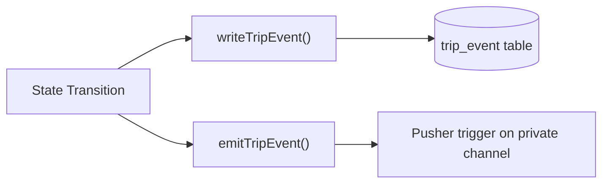
```mermaid
flowchart LR
    TRANSITION["State Transition"] --> WRITE["writeTripEvent()"]
    WRITE --> DB[("trip_event table")]

    TRANSITION --> EMIT["emitTripEvent()"]
    EMIT --> PUSHER["Pusher trigger on private channel"]
```

Each `trip_event` record captures the full context of what happened:

- **Who** performed the action — `actorId` (user ID) and `actorRole` (`passenger`, `driver`, or `system`)
- **What** happened — `event` field contains the transition name: `match`, `accept`, `reject`, `start`, `complete`, or `cancel`
- **When** it happened — `createdAt` timestamp
- **Context** — `metadata` field stores a JSON string with additional details such as the previous status, timestamps, and any score bonuses applied

This audit trail is immutable (append-only) and can be used for dispute resolution, analytics, and compliance reporting. The Pusher channel used is `private-trip.<rideId>`, ensuring only trip participants receive the real-time updates.

---

## 10. Real-Time System (Pusher)

### 10.1 Architecture

ECRP uses **Pusher** as a managed WebSocket service to deliver real-time events between trip participants. Pusher was chosen over raw WebSockets because it handles connection management, reconnection, and scaling — allowing the Next.js server to remain stateless.

The diagram below shows the real-time data flow. The driver's browser reads GPS coordinates and POSTs them to the API. The API persists them and triggers a Pusher event on the trip's private channel. The passenger's browser receives this event via WebSocket and updates the map marker. The admin dashboard can also subscribe to receive panic alerts.

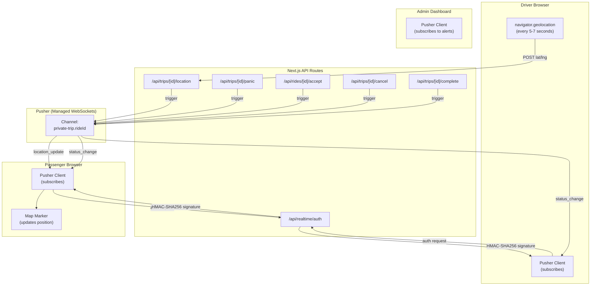
```mermaid
graph TB
    subgraph "Driver Browser"
        GEO["navigator.geolocation<br/>(every 5-7 seconds)"]
        DPC["Pusher Client<br/>(subscribes)"]
    end

    subgraph "Next.js API Routes"
        LOC["/api/trips/[id]/location"]
        PANIC["/api/trips/[id]/panic"]
        ACCEPT["/api/rides/[id]/accept"]
        CANCEL["/api/trips/[id]/cancel"]
        COMPLETE["/api/trips/[id]/complete"]
        AUTH_RT["/api/realtime/auth"]
    end

    subgraph "Pusher (Managed WebSockets)"
        CH["Channel:<br/>private-trip.rideId"]
    end

    subgraph "Passenger Browser"
        PPC["Pusher Client<br/>(subscribes)"]
        MAP["Map Marker<br/>(updates position)"]
    end

    subgraph "Admin Dashboard"
        ADM["Pusher Client<br/>(subscribes to alerts)"]
    end

    GEO -->|POST lat/lng| LOC
    LOC -->|trigger| CH
    PANIC -->|trigger| CH
    ACCEPT -->|trigger| CH
    CANCEL -->|trigger| CH
    COMPLETE -->|trigger| CH

    CH -->|location_update| PPC
    CH -->|status_change| PPC & DPC
    PPC --> MAP

    DPC & PPC -->|auth request| AUTH_RT
    AUTH_RT -->|HMAC-SHA256 signature| DPC & PPC
```

### 10.2 Channel Authentication

Pusher private channels require **server-side authentication** to prevent unauthorized users from eavesdropping on trip events. When the Pusher client library attempts to subscribe to a private channel, it first sends an authentication request to the ECRP backend. The server verifies that the requesting user is actually a participant in the trip before signing the channel subscription.

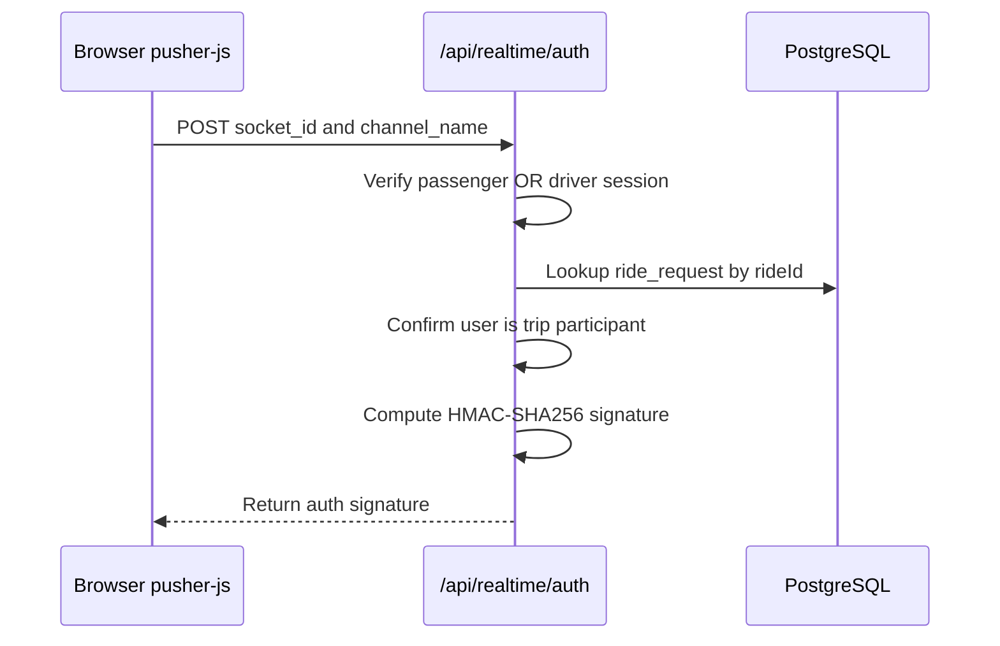
```mermaid
sequenceDiagram
    participant Client as Browser pusher-js
    participant Auth as /api/realtime/auth
    participant DB as PostgreSQL

    Client->>Auth: POST socket_id and channel_name
    Auth->>Auth: Verify passenger OR driver session
    Auth->>DB: Lookup ride_request by rideId
    Auth->>Auth: Confirm user is trip participant
    Auth->>Auth: Compute HMAC-SHA256 signature
    Auth-->>Client: Return auth signature
```

**How it works in detail:**

1. The Pusher client extracts the `rideId` from the channel name (`private-trip.<rideId>`)
2. The server checks if the authenticated user is either the `passengerId` or the `matchedDriverId` on that ride
3. If authorized, the server computes `HMAC-SHA256(appSecret, "socketId:channelName")` and returns the signature
4. The Pusher client presents this signature to the Pusher service to complete the subscription

**Key Details:**
- Channel format: `private-trip.<rideId>` (dot-separated, not hyphen)
- Only trip participants (passenger or matched driver) can subscribe
- Auth endpoint accepts both `application/x-www-form-urlencoded` and JSON body
- Client configures: `authEndpoint: "/api/realtime/auth"`, `authTransport: "ajax"`

### 10.3 GPS Telemetry Pipeline

During an active trip (`in_progress` status), the driver's browser continuously reads GPS coordinates and posts them to the server. The server validates the data, persists the latest position to the database, and broadcasts it via Pusher so the passenger's map updates in real time. This creates a smooth, near-real-time tracking experience without requiring the passenger to poll.

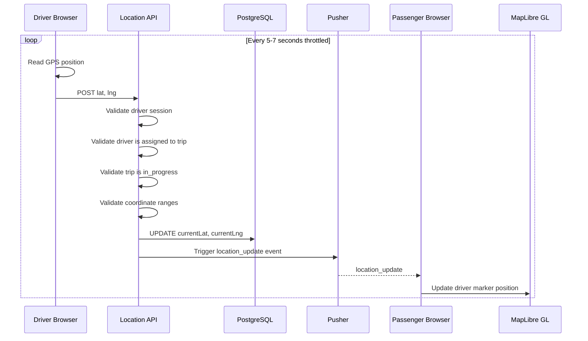
```mermaid
sequenceDiagram
    participant Driver as Driver Browser
    participant API as Location API
    participant DB as PostgreSQL
    participant Pusher as Pusher
    participant Passenger as Passenger Browser
    participant Map as MapLibre GL

    loop Every 5-7 seconds throttled
        Driver->>Driver: Read GPS position
        Driver->>API: POST lat, lng
        API->>API: Validate driver session
        API->>API: Validate driver is assigned to trip
        API->>API: Validate trip is in_progress
        API->>API: Validate coordinate ranges
        API->>DB: UPDATE currentLat, currentLng
        API->>Pusher: Trigger location_update event
        Pusher-->>Passenger: location_update
        Passenger->>Map: Update driver marker position
    end
```

**Throttling Strategy:**

The GPS update frequency is carefully balanced between user experience and cost:

- **Client-side throttle:** 5–7 second intervals between geolocation reads. This is intentionally slower than real-time to stay within Pusher's free-tier message limits (200k messages/day). For a typical 20-minute trip, this produces ~170-240 location events — well within budget.
- **Server-side rate limit:** 30 requests per 10 seconds per IP (enforced by middleware). This prevents a misbehaving client from overwhelming the system while still allowing normal GPS update cadence.

### 10.4 Event Types

| Event Name | Trigger | Payload | Channel |
|---|---|---|---|
| `location_update` | Driver posts GPS | `{ lat, lng, updatedAt }` | `private-trip.{rideId}` |
| `status_change` | Trip state transition | `{ status, endedAt? }` | `private-trip.{rideId}` |

**Server-Side Configuration:**
- Singleton Pusher instance (cached on `globalThis` for HMR stability)
- Required env vars: `PUSHER_APP_ID`, `PUSHER_APP_KEY`, `PUSHER_APP_SECRET`
- Default cluster: `mt1`
- TLS always enabled

---

## 11. Geocoding & Maps

ECRP needs to convert place names (like "Bole, Addis Ababa") into geographic coordinates (latitude/longitude) for mapping and distance calculations. Since no single geocoding provider is 100% reliable, the system uses a **dual-provider strategy** with automatic fallback.

### 11.1 Geocoding Pipeline

The flowchart below shows the geocoding decision tree. LocationIQ is preferred because it has better coverage for Ethiopian addresses and supports filtering by country code (`et`). Gebeta is used as a fallback when LocationIQ's key is not configured or when a request fails. If both providers fail, the function returns `null` and the caller must handle the missing coordinates (typically by returning a validation error to the user).

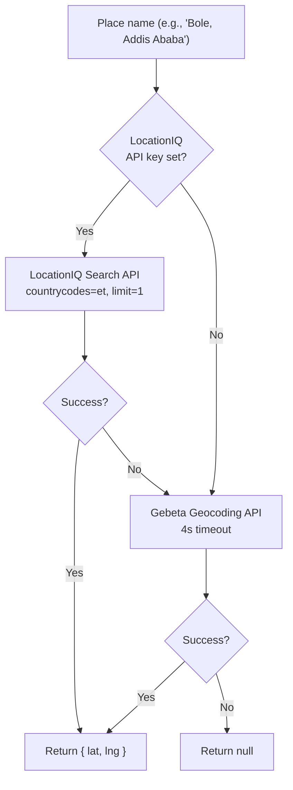
```mermaid
flowchart TD
    INPUT["Place name (e.g., 'Bole, Addis Ababa')"] --> LIQ{LocationIQ<br/>API key set?}

    LIQ -->|Yes| LIQ_REQ["LocationIQ Search API<br/>countrycodes=et, limit=1"]
    LIQ -->|No| GEBETA_REQ

    LIQ_REQ --> LIQ_OK{Success?}
    LIQ_OK -->|Yes| RESULT["Return { lat, lng }"]
    LIQ_OK -->|No| GEBETA_REQ["Gebeta Geocoding API<br/>4s timeout"]

    GEBETA_REQ --> GEBETA_OK{Success?}
    GEBETA_OK -->|Yes| RESULT
    GEBETA_OK -->|No| NULL["Return null"]
```

**LocationIQ (Primary):**
- Endpoint: `https://us1.locationiq.com/v1/search`
- Filters results to Ethiopia (`countrycodes=et`)
- 5-second timeout
- Returns up to 5 results for search, 1 for geocoding

**Gebeta (Fallback):**
- Endpoint: `https://mapapi.gebeta.app/api/v1/route/geocoding`
- 4-second timeout
- Used when LocationIQ key is not set or request fails

**Reverse Geocoding:**
- LocationIQ: `https://us1.locationiq.com/v1/reverse`
- Returns first comma-separated component of `display_name`

### 11.2 API Proxy Routes

All external map API calls are proxied through Next.js API routes to protect API keys. The browser never sees the actual Gebeta or LocationIQ API keys — it only calls internal `/api/` endpoints, which add the keys server-side before forwarding to the external service. The diagram below shows the three-layer architecture: browser → Next.js proxy → external API.

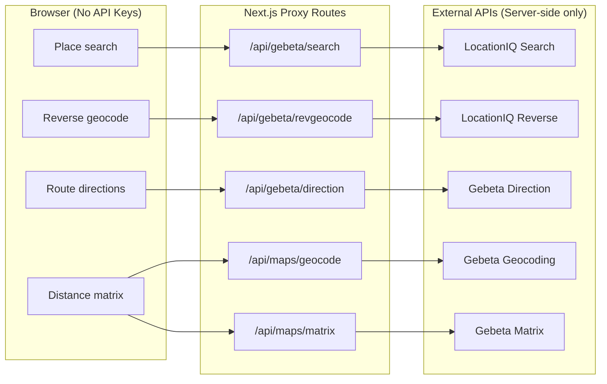
```mermaid
flowchart LR
    subgraph "Browser (No API Keys)"
        B1["Place search"]
        B2["Reverse geocode"]
        B3["Route directions"]
        B4["Distance matrix"]
    end

    subgraph "Next.js Proxy Routes"
        P1["/api/gebeta/search"]
        P2["/api/gebeta/revgeocode"]
        P3["/api/gebeta/direction"]
        P4["/api/maps/geocode"]
        P5["/api/maps/matrix"]
    end

    subgraph "External APIs (Server-side only)"
        E1["LocationIQ Search"]
        E2["LocationIQ Reverse"]
        E3["Gebeta Direction"]
        E4["Gebeta Geocoding"]
        E5["Gebeta Matrix"]
    end

    B1 --> P1 --> E1
    B2 --> P2 --> E2
    B3 --> P3 --> E3
    B4 --> P4 --> E4
    B4 --> P5 --> E5
```

**Client-Side Map Rendering:**
- Component: `src/components/app-map.tsx`
- Library: MapLibre GL via `@gebeta/tiles`
- **Lazy-loaded** via `next/dynamic` to prevent blocking initial page render
- Supports: markers, polylines (route display), real-time marker updates

---

## 12. Service Score System

The Service Score is a **non-monetary reputation metric** earned by drivers for verified trip completions. Unlike traditional ride-sharing platforms, ECRP has no payment system — the Service Score is the primary incentive for drivers to offer rides. A higher score signals reliability and community contribution.

The flowchart below shows what happens atomically when a driver completes a trip. The key detail is that all database operations (ride status update, profile update, score increment) happen in a **single database transaction** — if any step fails, everything rolls back to prevent inconsistent state.

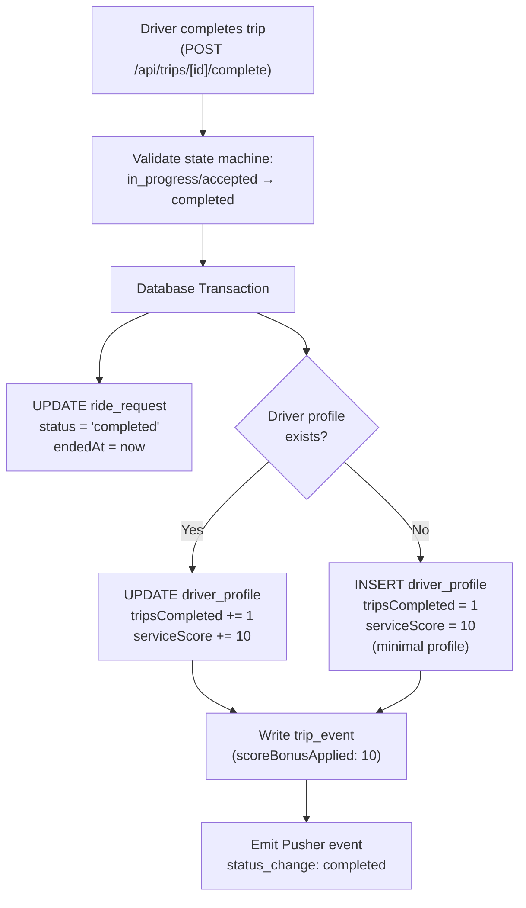
```mermaid
flowchart TD
    COMPLETE["Driver completes trip<br/>(POST /api/trips/[id]/complete)"] --> VALIDATE["Validate state machine:<br/>in_progress/accepted → completed"]

    VALIDATE --> TX["Database Transaction"]

    TX --> UPDATE_RIDE["UPDATE ride_request<br/>status = 'completed'<br/>endedAt = now"]
    TX --> CHECK_PROFILE{Driver profile<br/>exists?}

    CHECK_PROFILE -->|Yes| INCREMENT["UPDATE driver_profile<br/>tripsCompleted += 1<br/>serviceScore += 10"]
    CHECK_PROFILE -->|No| SEED["INSERT driver_profile<br/>tripsCompleted = 1<br/>serviceScore = 10<br/>(minimal profile)"]

    INCREMENT --> AUDIT["Write trip_event<br/>(scoreBonusApplied: 10)"]
    SEED --> AUDIT

    AUDIT --> EMIT["Emit Pusher event<br/>status_change: completed"]
```

**Scoring Rules:**
- **+10 points** per verified trip completion (`COMPLETION_SCORE_BONUS = 10`)
- Score and trip count updated **atomically** in a database transaction
- If driver has no profile (edge case), a minimal profile is auto-created
- **Admin CSV ingestion** can adjust scores for traffic violations (via admin dashboard)

**Admin Score Adjustment:**
Admins can upload CSV files containing traffic authority penalty data:
- CSV format: license plate, violation type
- System matches drivers by plate number
- Scores are adjusted mathematically based on violation severity

---

## 13. Emergency Alert (Panic) System

The panic button is a critical safety feature available to both passengers and drivers during an active trip. When pressed, it immediately creates a high-priority alert in the admin dashboard with the sender's current location. The system is intentionally designed to be low-friction — a single tap sends the alert without requiring confirmation dialogs.

The alert lifecycle has two phases: **creation** (by the trip participant) and **resolution** (by an admin). The diagram below shows both phases.

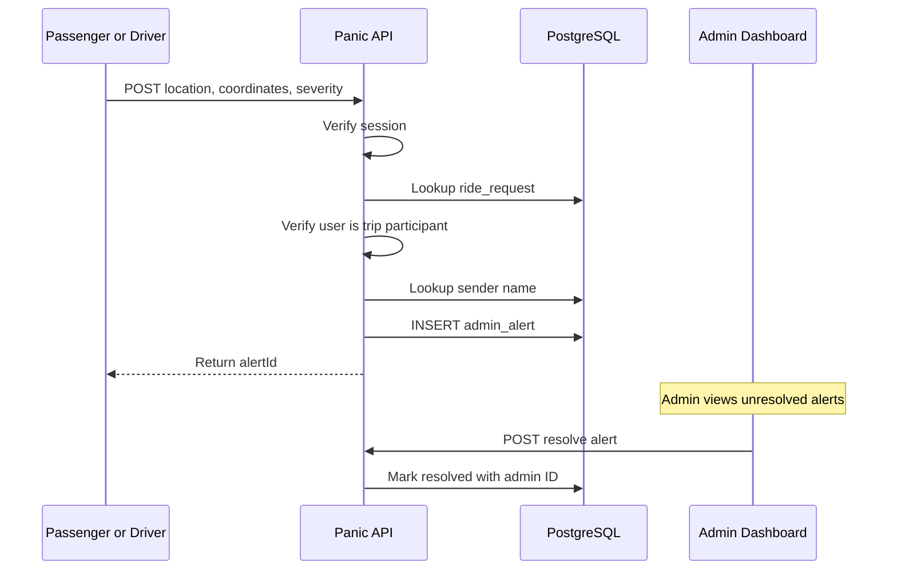
```mermaid
sequenceDiagram
    participant User as Passenger or Driver
    participant API as Panic API
    participant DB as PostgreSQL
    participant Admin as Admin Dashboard

    User->>API: POST location, coordinates, severity
    API->>API: Verify session
    API->>DB: Lookup ride_request
    API->>API: Verify user is trip participant

    API->>DB: Lookup sender name
    API->>DB: INSERT admin_alert

    API-->>User: Return alertId

    Note over Admin: Admin views unresolved alerts

    Admin->>API: POST resolve alert
    API->>DB: Mark resolved with admin ID
```

**How the alert lifecycle works:**

1. **Trigger:** Either the passenger or driver taps the panic button on the active trip screen. The client sends the current GPS coordinates, a text description of the location, and a severity level.

2. **Server processing:** The API validates the user's session, confirms they are a participant in the trip, looks up their display name from the appropriate user table, and inserts a new `admin_alert` record with `resolved: false`.

3. **Admin response:** Admins see unresolved alerts on their dashboard (sorted by severity and time). After taking action (contacting users, dispatching help), they mark the alert as resolved — recording which admin handled it and when.

**Alert Properties:**
- **Severity levels:** `low`, `medium`, `high` (defaults to `high` for panic button presses)
- **Sender role:** Tracked as `driver` or `passenger` so admins know who triggered it
- **Location data:** Both a text description and raw coordinates string are stored for maximum flexibility
- **Resolution:** Admin marks as resolved — this records the admin's user ID and a timestamp for accountability
- **Rate limited:** 3 requests per 60 seconds per IP — prevents accidental spam while ensuring genuine emergencies always get through

---

## 14. Admin Dashboard

The admin dashboard (`/admin`) provides operational oversight of the entire platform. It is protected by the middleware — only users with the `admin` or `super_admin` role can access these pages. The diagram below shows the page structure and the API endpoints that power each page.

```mermaid
graph TB
    subgraph "Admin Dashboard Pages"
        OVERVIEW["Overview<br/>/admin"]
        USERS["Active Users<br/>/admin/users"]
        TRIPS["Active Trips<br/>/admin/trips"]
        ALERTS["Alerts<br/>/admin/alerts"]
        ADMINS["Admin Management<br/>/admin/admins"]
    end

    subgraph "API Endpoints"
        A1["GET /api/admin/overview"]
        A2["GET /api/admin/active-users"]
        A3["GET /api/admin/active-trips"]
        A4["GET /api/admin/alerts"]
        A5["POST /api/admin/alerts/[id]/resolve"]
        A6["GET /api/admin/admins"]
        A7["POST /api/admin/admins"]
        A8["GET /api/admin/me"]
        A9["GET /api/admin/documents"]
        A10["POST /api/admin/documents/[id]"]
    end

    OVERVIEW --> A1
    USERS --> A2
    TRIPS --> A3
    ALERTS --> A4 & A5
    ADMINS --> A6 & A7
```

**Overview Metrics (GET /api/admin/overview):**

| Metric | Description |
|---|---|
| Active Trips | Rides with status: requested, matched, accepted, in_progress |
| Online Users | Drivers with `isOnline = true` |
| Today's Trips | Completed/cancelled trips since midnight |
| Open Alerts | Unresolved panic alerts |
| Recent Activity | Last 6 finished trips + last 3 alerts |
| User Counts | Total passengers, total drivers |

**Access Control:**
- All admin endpoints require `admin` or `super_admin` role
- Admin creation restricted to `super_admin` only
- Password minimum: 8 characters
- Email must be unique and valid format

---

## 15. Driver Document Management

Drivers can upload verification documents that are reviewed by admins.

```mermaid
stateDiagram-v2
    [*] --> pending : Driver uploads document
    pending --> verified : Admin approves
    pending --> rejected : Admin rejects
    verified --> [*]
    rejected --> [*]
```

**Document Types:**
| Type | Description |
|---|---|
| `license` | Driver's license |
| `registration` | Vehicle registration |
| `insurance` | Vehicle insurance |

**Stored Fields:**
- `originalName` — original filename
- `filePath` — server storage path
- `mimeType` — file MIME type
- `fileSize` — size in bytes
- `reviewedByAdminId` / `reviewedByAdminName` — admin who reviewed
- `reviewedAt` — review timestamp

**API Endpoints:**
| Method | Path | Description |
|---|---|---|
| `GET` | `/api/driver/documents` | List driver's documents |
| `POST` | `/api/driver/documents` | Upload new document |
| `GET` | `/api/driver/documents/[id]` | Get single document |
| `DELETE` | `/api/driver/documents/[id]` | Delete document |
| `GET` | `/api/admin/documents` | List all documents (admin) |
| `POST` | `/api/admin/documents/[id]` | Review document (admin) |

---

## 16. API Reference

### Authentication

| Method | Path | Description | Auth |
|---|---|---|---|
| `*` | `/api/auth/[...all]` | Passenger Better Auth handler | Public |
| `*` | `/api/driver-auth/[...all]` | Driver Better Auth handler | Public |
| `*` | `/api/admin-auth/[...all]` | Admin Better Auth handler | Public |
| `GET` | `/api/telegram/callback` | Telegram OAuth callback + session creation | Public |
| `POST` | `/api/realtime/auth` | Pusher private-channel auth | Passenger or Driver |

### Rides

| Method | Path | Description | Auth |
|---|---|---|---|
| `POST` | `/api/rides/request` | Create ride request + auto-match | Passenger |
| `GET` | `/api/rides/matches` | Fetch matched drivers for a request | Passenger |
| `POST` | `/api/rides/[id]/accept` | Driver accepts a ride | Driver |
| `POST` | `/api/rides/[id]/reject` | Driver rejects a ride | Driver |

### Trips

| Method | Path | Description | Auth |
|---|---|---|---|
| `POST` | `/api/trips/[id]/start` | Start the trip | Driver |
| `POST` | `/api/trips/[id]/complete` | Complete trip + award score | Driver |
| `POST` | `/api/trips/[id]/cancel` | Cancel (either party) | Passenger or Driver |
| `POST` | `/api/trips/[id]/location` | Post GPS coordinates | Driver |
| `POST` | `/api/trips/[id]/panic` | Trigger panic alert | Passenger or Driver |
| `GET` | `/api/trips/[id]/stream` | *Deprecated (410)* — Use Pusher | — |
| `GET` | `/api/trips/active` | Fetch active trip for current user | Passenger or Driver |
| `GET` | `/api/trips/history` | Fetch completed/cancelled trips | Passenger or Driver |

### Driver

| Method | Path | Description | Auth |
|---|---|---|---|
| `GET` | `/api/driver/availability` | Get driver's online status | Driver |
| `PATCH` | `/api/driver/availability` | Toggle online status | Driver |
| `GET/PUT` | `/api/driver/route` | Get/set daily route start & end | Driver |
| `GET` | `/api/driver/me` | Fetch driver profile | Driver |
| `GET/POST` | `/api/driver/documents` | List/upload documents | Driver |
| `GET/DELETE` | `/api/driver/documents/[id]` | Get/delete document | Driver |

### Passenger

| Method | Path | Description | Auth |
|---|---|---|---|
| `GET` | `/api/passenger/me` | Fetch passenger profile | Passenger |

### Maps (API Key Proxy)

| Method | Path | Description | Auth |
|---|---|---|---|
| `GET` | `/api/maps/geocode` | Forward geocoding (LocationIQ → Gebeta) | Server-side |
| `GET` | `/api/maps/matrix` | Distance/duration matrix | Server-side |
| `GET` | `/api/gebeta/search` | Place search | Public |
| `GET` | `/api/gebeta/revgeocode` | Reverse geocoding | Public |
| `GET` | `/api/gebeta/direction` | Route directions (polyline) | Public |

### Admin

| Method | Path | Description | Auth |
|---|---|---|---|
| `GET` | `/api/admin/overview` | Dashboard summary metrics | Admin |
| `GET` | `/api/admin/active-users` | Currently online users | Admin |
| `GET` | `/api/admin/active-trips` | In-progress trips | Admin |
| `GET` | `/api/admin/alerts` | Unresolved panic alerts | Admin |
| `POST` | `/api/admin/alerts/[id]/resolve` | Mark alert resolved | Admin |
| `GET` | `/api/admin/admins` | List admin accounts | Admin |
| `POST` | `/api/admin/admins` | Create admin account | Super Admin |
| `GET` | `/api/admin/me` | Current admin session info | Admin |
| `GET` | `/api/admin/documents` | List all driver documents | Admin |
| `POST` | `/api/admin/documents/[id]` | Review (approve/reject) document | Admin |

---

## 17. Error Handling

ECRP uses a consistent error response format across all API routes:

```json
{
  "error": "Human-readable error message",
  "code": "ERROR_CODE",
  "status": 400
}
```

### Error Codes

| Code | HTTP Status | Description |
|---|---|---|
| `UNAUTHORIZED` | 401 | Missing or invalid session |
| `FORBIDDEN` | 403 | Valid session but insufficient permissions |
| `NOT_FOUND` | 404 | Resource does not exist |
| `CONFLICT` | 409 | Resource state conflict (e.g., ride already assigned) |
| `INVALID_JSON` | 400 | Request body is not valid JSON |
| `VALIDATION_ERROR` | 400 | Request data fails validation |
| `INVALID_TRANSITION` | 400 | State machine rejects the transition |
| `RATE_LIMITED` | 429 | Too many requests (includes `Retry-After` header) |
| `INTERNAL_ERROR` | 500 | Unexpected server error |
| `SERVICE_UNAVAILABLE` | 503 | External service not configured |

### Error Flow

The flowchart below shows the order in which checks are performed. This ordering is intentional — authentication is checked first (cheapest), then authorization, then input validation, then resource existence, then state validity, and finally the actual business logic. This means a user with an expired session gets a clear 401 rather than a confusing 404.

```mermaid
flowchart TD
    REQ["API Request"] --> AUTH{Authenticated?}
    AUTH -->|No| E401["401 UNAUTHORIZED"]
    AUTH -->|Yes| PERM{Authorized?}
    PERM -->|No| E403["403 FORBIDDEN"]
    PERM -->|Yes| VALIDATE{Input valid?}
    VALIDATE -->|No| E400["400 VALIDATION_ERROR"]
    VALIDATE -->|Yes| RESOURCE{Resource exists?}
    RESOURCE -->|No| E404["404 NOT_FOUND"]
    RESOURCE -->|Yes| STATE{State valid?}
    STATE -->|No| E400_T["400 INVALID_TRANSITION"]
    STATE -->|Yes| PROCESS["Process request"]
    PROCESS -->|Error| E500["500 INTERNAL_ERROR"]
    PROCESS -->|Success| OK["200/201 Success"]
```

---

## 18. Environment Variables

| Variable | Required | Description |
|---|---|---|
| `DATABASE_URL` | Yes | PostgreSQL connection string |
| `BETTER_AUTH_SECRET` | Yes | Session signing secret (generate: `openssl rand -base64 32`) |
| `BETTER_AUTH_URL` | Yes | App base URL (e.g., `http://localhost:3000`) |
| `NEXT_PUBLIC_GEBETA_API_KEY` | Yes | Gebeta Maps API key (tiles + fallback geocoding) |
| `LOCATIONIQ_API_KEY` | Yes | LocationIQ API key (primary geocoding) |
| `TELEGRAM_BOT_TOKEN` | Yes | Telegram Bot token (from @BotFather) |
| `NEXT_PUBLIC_TELEGRAM_BOT_USERNAME` | Yes | Telegram bot username |
| `NEXT_PUBLIC_TELEGRAM_REQUEST_ACCESS` | No | `read` (default) or `write` |
| `PUSHER_APP_ID` | Yes | Pusher application ID |
| `PUSHER_APP_KEY` / `NEXT_PUBLIC_PUSHER_APP_KEY` | Yes | Pusher key (server + client) |
| `PUSHER_APP_SECRET` | Yes | Pusher secret (server only) |
| `PUSHER_APP_CLUSTER` / `NEXT_PUBLIC_PUSHER_APP_CLUSTER` | No | Pusher cluster (default: `mt1`) |
| `ADMIN_EMAIL` | Seed only | Super admin email for `npm run db:seed` |
| `ADMIN_PASSWORD` | Seed only | Super admin password for `npm run db:seed` |
| `ADMIN_NAME` | No | Super admin display name (default: `ECRP Super Admin`) |

> **Security:** `ADMIN_EMAIL` and `ADMIN_PASSWORD` have no hardcoded defaults. The seed script exits with an error if either is missing.

---

## 19. Getting Started

### Prerequisites

- **Node.js 20+**
- **PostgreSQL database** (Neon Serverless recommended)
- **Pusher account** (free tier works)
- **Gebeta Maps API key** ([gebeta.app](https://gebeta.app/))
- **LocationIQ API key** ([locationiq.com](https://locationiq.com/))
- **Telegram Bot Token** (from [@BotFather](https://t.me/BotFather))

### Quick Start

```bash
# 1. Clone the repository
git clone <repo-url>
cd ecrp

# 2. Install dependencies
npm install

# 3. Configure environment
cp .env.example .env.local
# Fill in all required environment variables

# 4. Push database schema
npm run db:push

# 5. Seed the super admin account
npm run db:seed

# 6. Start the development server
npm run dev
```

Open [http://localhost:3000](http://localhost:3000).

### Available Scripts

| Script | Description |
|---|---|
| `npm run dev` | Start Next.js development server |
| `npm run build` | Production build |
| `npm run start` | Start production server |
| `npm run lint` | Run ESLint |
| `npm run test:unit` | Run Vitest unit tests |
| `npm run test:unit:watch` | Vitest in watch mode |
| `npm run test:coverage` | Run tests with coverage report |
| `npm run db:generate` | Generate Drizzle migration from schema |
| `npm run db:push` | Push schema directly to database |
| `npm run db:migrate` | Run pending migrations |
| `npm run db:studio` | Open Drizzle Studio (DB GUI) |
| `npm run db:seed` | Create initial super admin account |

> **Telegram OAuth note:** Telegram requires a real public domain for the login widget. For local development, use [ngrok](https://ngrok.com/) or a similar tunnel and register that domain with your bot via `/setdomain` in BotFather.
